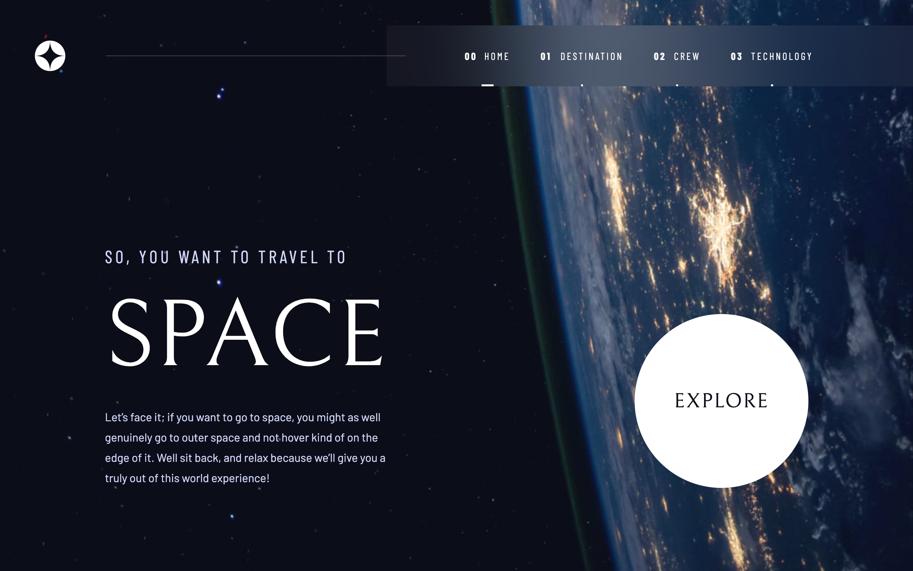

# Frontend Mentor - Space tourism website solution

This is a solution to the [Space tourism website challenge on Frontend Mentor](https://www.frontendmentor.io/challenges/space-tourism-multipage-website-gRWj1URZ3). Frontend Mentor challenges help you improve your coding skills by building realistic projects. 

## Table of contents

- [Frontend Mentor - Space tourism website solution](#frontend-mentor---space-tourism-website-solution)
  - [Table of contents](#table-of-contents)
  - [Overview](#overview)
    - [The challenge](#the-challenge)
    - [Screenshot](#screenshot)
    - [Links](#links)
  - [My process](#my-process)
    - [Built with](#built-with)
    - [What I learned](#what-i-learned)
    - [Continued development](#continued-development)
    - [Useful resources](#useful-resources)
  - [Author](#author)
  - [Acknowledgments](#acknowledgments)
- [README from Next.js](#readme-from-nextjs)
  - [Getting Started](#getting-started)
  - [Learn More](#learn-more)
  - [Deploy on Vercel](#deploy-on-vercel)
- [Additional commands for development](#additional-commands-for-development)
  - [Component Driven Development](#component-driven-development)
  - [Unit testing](#unit-testing)
  - [E2E testing](#e2e-testing)

## Overview

### The challenge

Users should be able to:

- View the optimal layout for each of the website's pages depending on their device's screen size
- See hover states for all interactive elements on the page
- View each page and be able to toggle between the tabs to see new information

### Screenshot



### Links

- Solution URL: [GitHub](https://github.com/TakumaKira/space-tourism-website)
- Live Site URL: [Vercel](https://space-tourism-website-git-master-takumakira.vercel.app/)

## My process

### Built with

- [React](https://reactjs.org/) - JS library
- [Next.js](https://nextjs.org/) - React framework
- [Styled Components](https://styled-components.com/) - For styles
- [Storybook](https://storybook.js.org/) - For Component Driven Development
- [Jest](https://jestjs.io/) - For unit tests
- [Cypress](https://www.cypress.io/) - For E2E tests

### What I learned

- How to build multi-page website with Next.js, Storybook and Styled Components, testing with Jest and Cypress.
- I found out Next.js is still not well developed especially around mocking some modules with Jest. Maybe I can contribute?

### Continued development

- I still need to learn more about Server side rendering.

### Useful resources

- [Unit testing Next.js API routes](https://seanconnolly.dev/unit-testing-nextjs-api-routes) - This told me the easiest way to test Next.js API.
- [What are the best screen sizes for responsive web design in 2022?](https://www.hobo-web.co.uk/best-screen-size/) - Referencing this page, I set responsive break point width.
- [idiomatic way to share styles in styled-components?](https://stackoverflow.com/questions/49618997/idiomatic-way-to-share-styles-in-styled-components) - This told me the ways to share styles in styled-components.
- [How TO - Aspect Ratio](https://www.w3schools.com/howto/howto_css_aspect_ratio.asp) - I needed to maintain the aspect ratio of image container div.

## Author

- Website - [TakumaKira](https://github.com/TakumaKira)
- Frontend Mentor - [@TakumaKira](https://www.frontendmentor.io/profile/TakumaKira)

## Acknowledgments

# README from Next.js

This is a [Next.js](https://nextjs.org/) project bootstrapped with [`create-next-app`](https://github.com/vercel/next.js/tree/canary/packages/create-next-app).

## Getting Started

First, run the development server:

```bash
npm run dev
# or
yarn dev
```

Open [http://localhost:3000](http://localhost:3000) with your browser to see the result.

You can start editing the page by modifying `pages/index.tsx`. The page auto-updates as you edit the file.

[API routes](https://nextjs.org/docs/api-routes/introduction) can be accessed on [http://localhost:3000/api/hello](http://localhost:3000/api/hello). This endpoint can be edited in `pages/api/hello.ts`.

The `pages/api` directory is mapped to `/api/*`. Files in this directory are treated as [API routes](https://nextjs.org/docs/api-routes/introduction) instead of React pages.

## Learn More

To learn more about Next.js, take a look at the following resources:

- [Next.js Documentation](https://nextjs.org/docs) - learn about Next.js features and API.
- [Learn Next.js](https://nextjs.org/learn) - an interactive Next.js tutorial.

You can check out [the Next.js GitHub repository](https://github.com/vercel/next.js/) - your feedback and contributions are welcome!

## Deploy on Vercel

The easiest way to deploy your Next.js app is to use the [Vercel Platform](https://vercel.com/new?utm_medium=default-template&filter=next.js&utm_source=create-next-app&utm_campaign=create-next-app-readme) from the creators of Next.js.

Check out our [Next.js deployment documentation](https://nextjs.org/docs/deployment) for more details.

# Additional commands for development

## Component Driven Development

First, run the development server:

```bash
yarn storybook
```

Open [http://localhost:6006](http://localhost:6006) with your browser to see the result.

## Unit testing

Run the tests with:

```bash
yarn test
```

You will see the results in the terminal.

## E2E testing

Run E2E tests with:

```bash
yarn cypress
```

Or, headlessly:

```bash
yarn cypress:headless
```
